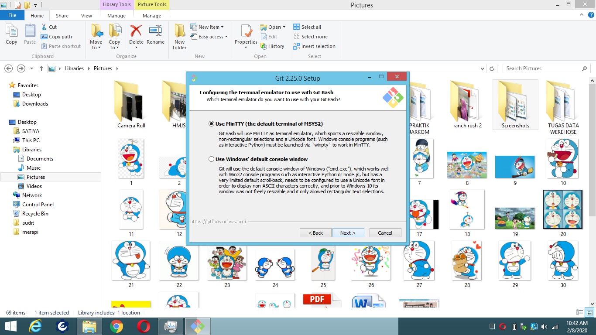
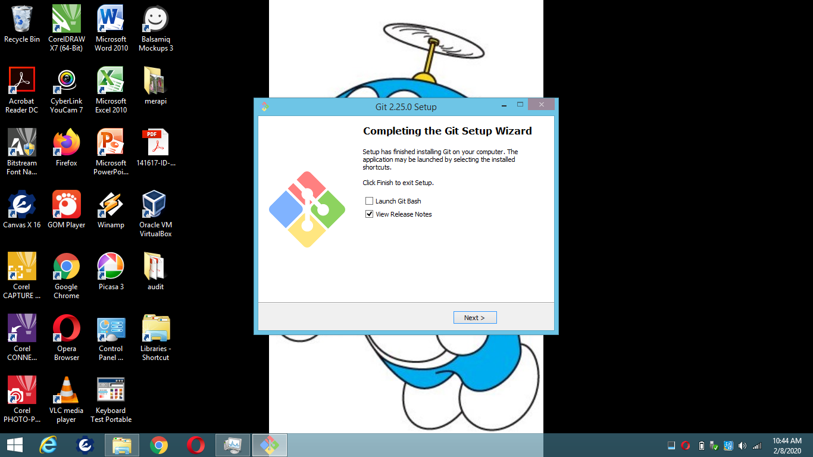

   # latihan
   
   ## INSTAL Git
   
Maka akan muncul infomasi lisensi Git, klik Next > untuk melanjutkan.

Selanjutnya menentukan lokasi instalasi. Biarkan saja apa adanya, kemudian klik Next >.

Selanjutnya pemilihan komoponen, biarkan saja seperti ini kemudian klik Next >.

Selanjutnya pemlilihan direktori start menu, klik Next >.

Selanjutnya pengaturan PATH Environment. Pilih yang tengah agar perintah git dapat di kenali di Command Prompt (CMD). Setelah itu klik Next >.

Selanjutnya konversi line ending. Biarkan saja seperti ini, kemudian klik Next >.

Selanjutnya pemilihan emulator terminal. Pilih saja yang bawah, kemudian klik Next >.

Selanjutnya pemilihan opsi ekstra. Klik saja Next >.

Selanjutnya pemilihan opsi ekspreimental, langsung saja klik Install untuk memaulai instalasi.

Tunggu beberapa saat, instalasi sedang dilakukan.

Setelah selesai, kita bisa langsung klik Finish.

   

   ## Configurasi Git
   
   
   
   ## Mengelola Repo 
   
   
   
   